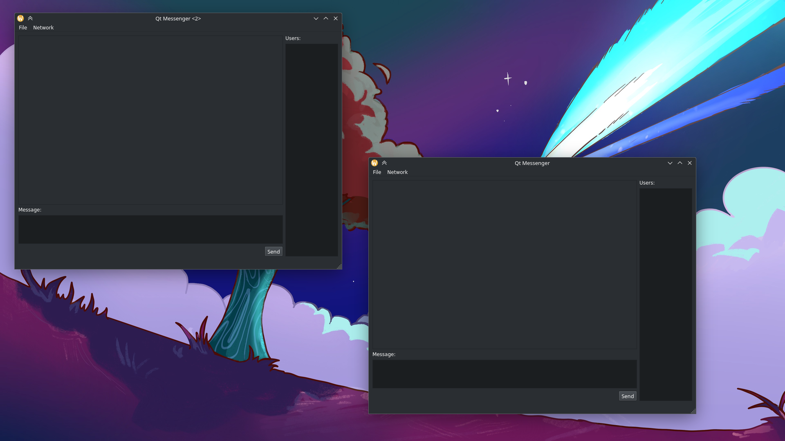
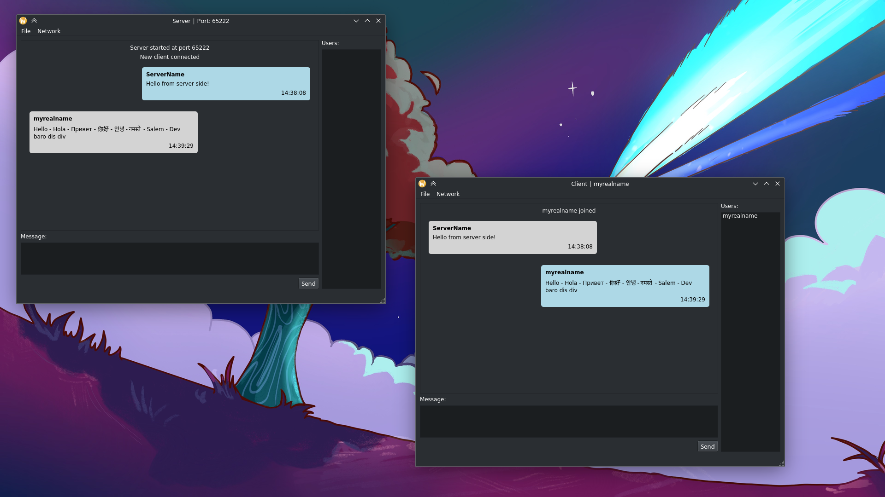
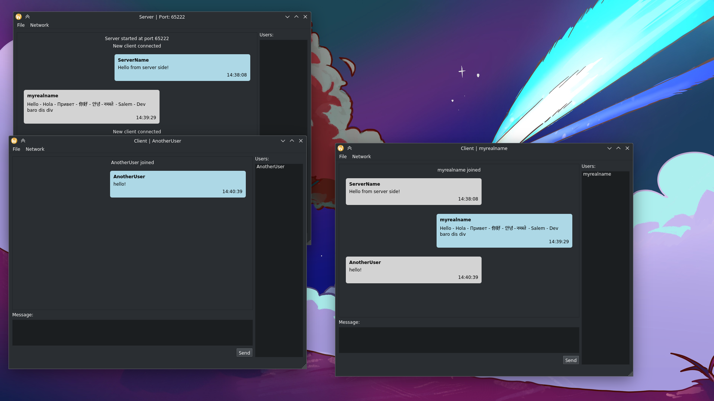

# Qt Messenger

The application implements a simple messenger with client-server architecture. Initially, a server is created, and then users connect to it.
The server knows each client and can interact with it if necessary. Clients know only about the server, there is no direct communication between clients.

Also, within the scope of the project was realized displaying and highlighting of ordinary and “service” messages sent by clients (server).

The project is still worth working on. From the nearest tasks:
- [ ]  A separate client class to store information (status, nickname, color and avatar) for transferring it to the server;
- [ ]  Marking of messages as received and read (example, whats app);
- [ ]  Saving and restoring messages via sql storages;
- [ ]  Improvement of visual component;

## Screenshots

1. First application launch

2. Connection Manager

3. Client and server connection

4. Sending and receiving messages

5. Connecting another user

